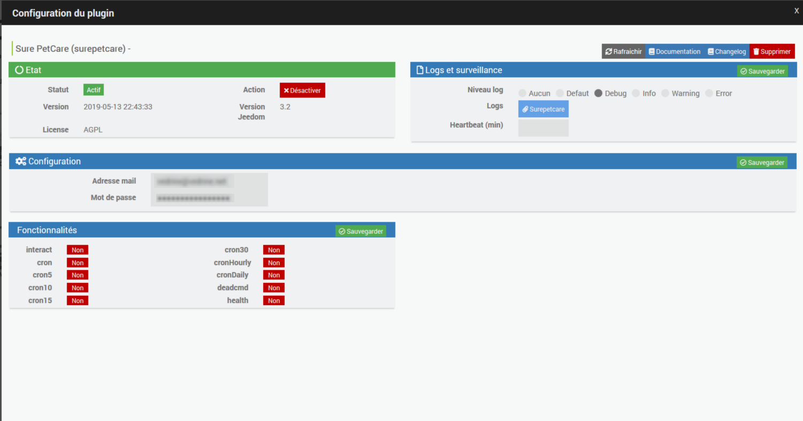
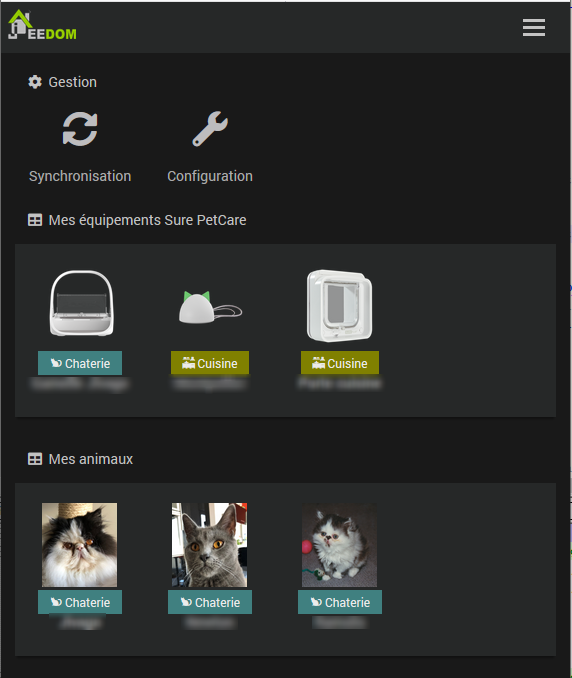
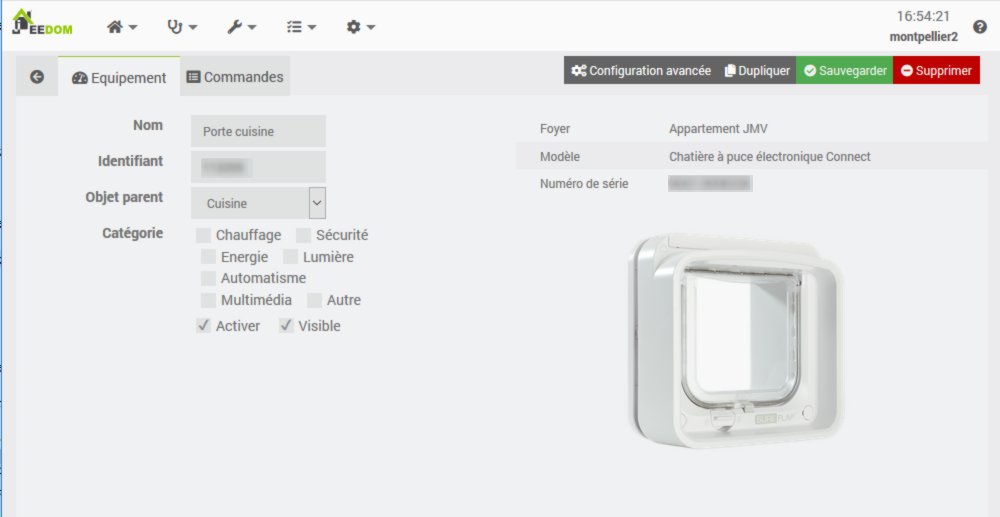
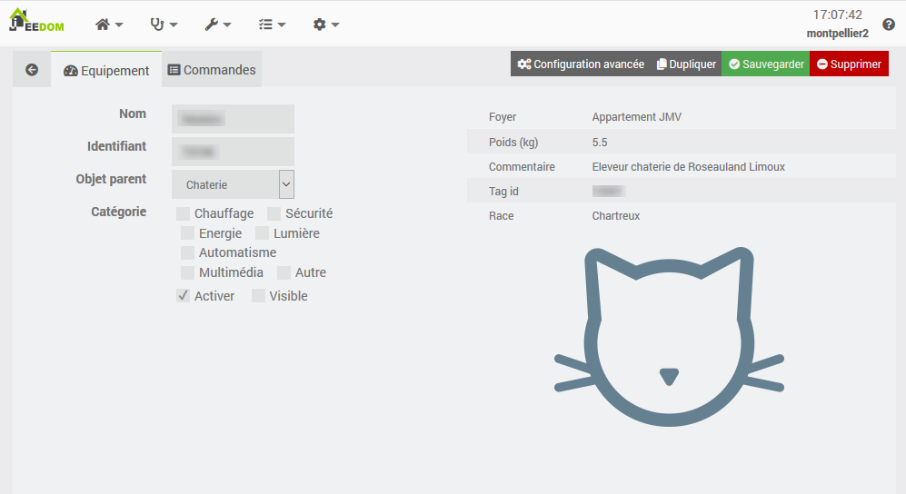

Description
===

Plugin permettant de contrôler les objets connectés pour animaux de la marque Sure Petcare (anciennement Sureflap).

Pour le moment les seuls objets connectés supportés par le plugin sont :
- La grande chatière connect (Pet Porte Connect ou Microchip Pet Door Connect en anglais)
- La chatière à puce électronique connect (Microchip Cat Flap Connect en anglais)
- Le distributeur de nourriture connect (Feeder Connect en anglais)
- La fontaine Felaqua (Felaqua Connect)

Note : le plugin ne communique pas directement avec la chatière, le distributeur, la fontaine ou le hub,
il interroge le serveur surepetcare.io qui lui communique avec le hub et à travers lui avec les objets connectés.
A ma connaissance personne n'a pu décoder le protocole utilisé lors des communications chatière <-> hub 
ou hub <-> serveur surepetcare.io ce qui s'explique car ces communications sont sécurisées.

Avant d'activer le plugin il faut que votre compte sur le serveur de surepetcare.io soit créé avec une adresse mail et un mot de passe
et il faut que l'appli IOS ou Android fonctionne.

Configuration du plugin
===

Il faut entrer :

-   **Adresse mail** : L'adresse mail que vous avez donnée lors de la création du compte sur le site surepetcare.io.

-   **Mot de passe** : Le mot de passe que vous avez choisi lors de la création du compte sur le site surepetcare.io.

- Eventuellement vous pouvez changer l'intervalle d'**Auto-actualisation (cron)** pour interroger le serveur moins souvent.

Et ne pas oublier de cliquer sur **Sauvegarder**.

Création des équipements
===

Cliquez sur "Synchronisation"
et le plugin retrouvera sur le site surepetcare.io vos hubs, vos objets connecté (hubs, chatières, distributeurs, fontaines, ...) et vos animaux.

Le plugin est prévu pour un ou plusieurs foyers, mais les foyers n'apparaissent pas comme des objets dans le plugin.
Par contre pour chaque objet (équipement ou animal) le foyer dont il dépend est indiqué dans les détails.

Lorsqu'on clique sur le bouton "Synchronisation" le plugin récupère tous les équipements et tous les animaux pour tous les foyers du compte.

Si on le désire il est ensuite possible de supprimer certains objets, mais cette opération sera à renouveler à chaque synchronisation
car l'objet réapparaîtra s'il est dans votre compte sur le serveur de surepetcare.io.
Pour cette raison, il est préférable de ne pas supprimer l'objet mais plutôt de décocher "Visible" pour les objets qu'on ne souhaite pas visualiser.

Les Objets
===
En cliquant sur un équipement, on accède aux détails de cet équipement :

Idem pour un animal mais les informations sont différentes

On peut choisir l'objet parent parmi les objets Jeedom pour contrôler où apparaîtra le widget de cet équipement
ou de cet animal sur le dashboard si bien sûr on coche "Visible".

On peut changer le nom de l'objet, ce changement sera conservé même en cas de nouvelle synchronisation.

Il ne faut pas changer le "Logical ID" de la commande sinon elle ne marche plus.

Il ne faut surtout pas changer le champ "Identifiant" sinon aucune commande pour cet objet ne marche plus et lors de la prochaine synchronisation
l'objet sera considéré comme nouveau et réimporté aboutissant à un  doublon (si jamais vous faites cette erreur, supprimez l'objet et faites une nouvelle synchronisation).

Pour une chatière on peut définir les heures de début et de fin du couvre-feu au format HHMM, par exemple 0630 pour 6 heure 30 minutes.

Attention, une commande "Activer couvre-feu" provoque une erreur si on n'a pas définit les heures de début et de fin dans la configuration de l'équipement.

L'onglet "Planning" permet de définir des évènements dans le plugin Agenda, s'il est installé, pour effectuer des actions à des jours et des heures déterminées.
Seules les commandes action sont programmables.

Les commandes disponibles
===

En cliquant sur l'onglet commande vous accédez aux commandes disponibles.

Ces commandes sont différentes pour un hub, un objet connecté ou un animal.
.

## Commandes pour un hub

| Nom                                  | Type    | Sous type  | Rôle                                                                                                                                                               |
| :--:                                 | :---:   | :---:      | :---:                                                                                                                                                              |
| **En ligne**                         | info    | binaire    | Indique si le hub est en ligne.                                                                                                                                    |
| **Mode led**                         | action  | liste      | Fixe le mode d'allumage des leds ("oreilles") du hub (Eteint, Brillant, Atténué).                                                                                  |
| **Etat led**                         | info    | numerique  | Indique le mode d'allumage des leds ("oreilles") du hub (0=Eteint, 1=Brillant, 4=Atténué).                                                                         |

## Commandes pour un distributeur de nourriture

| Nom                                  | Type    | Sous type  | Rôle                                                                                                                                                               |
| :--:                                 | :---:   | :---:      | :---:                                                                                                                                                              |
| **En ligne**                         | info    | binaire    | Indique si le distributeur est en ligne.                                                                                                                           |
| **Réception équipement**             | info    | numérique  | Indique le niveau de réception de la liaison radio (RSSI Received Signal Strength Indication) du distributeur en dBm                                               |
| **Réception hub**                    | info    | numérique  | Indique le niveau de réception de la liaison radio (RSSI Received Signal Strength Indication) du hub en dBm                                                        |
| **Type de bol**                      | info    | numérique  | Indique le type de bol(s) (1= Bol simple, 4= demi-bols)                                                                                                            |
| **Type nourriture bol 1**            | info    | numérique  | Indique le type de nourriture dans le bol 1 (1=humide 2=seche 3=humide et seche)                                                                                   |
| **Type nourriture bol 2**            | info    | numérique  | Indique le type de nourriture dans le bol 2 (1=humide 2=seche 3=humide et seche)                                                                                   |
| **Portion bol 1**                    | info    | numérique  | Indique le poids d'une portion pour le bol 1 en g                                                                                                                  |
| **Portion bol 2**                    | info    | numérique  | Indique le poids d'une portion pour le bol 2 en g                                                                                                                  |
| **Délai de fermeture**               | info    | numérique  | Indique le délai de fermeture (0=Rapide, 4=Normal, 20=Lentement)                                                                                                   |
| **Mode apprentissage**               | info    | numérique  | Indique le mode apprentissage (0=Pas activé et ensuite les étapes de 1 à 4)                                                                                        |
| **Assigner animal**                  | action  | liste      | Ajoute un animal dans la liste des animaux assignés au distributeur. Il faut choisir l'animal dans la liste.               |
| **Retirer animal**                   | action  | liste      | Retire un animal de la liste des animaux assignés au distributeur. Il faut choisir l'animal dans la liste. 

## Commandes pour une fontaine Felaqua

| Nom                                  | Type    | Sous type  | Rôle                                                                                                                                                               |
| :--:                                 | :---:   | :---:      | :---:                                                                                                                                                              |
| **En ligne**                         | info    | binaire    | Indique si la fontaine est en ligne.                                                                                                                               |
| **Réception équipement**             | info    | numérique  | Indique le niveau de réception de la liaison radio (RSSI Received Signal Strength Indication) de la fontaine en dBm                                                |
| **Réception hub**                    | info    | numérique  | Indique le niveau de réception de la liaison radio (RSSI Received Signal Strength Indication) du hub en dBm                                                        |
| **Tare**                             | info    | numérique  | Indique la tare (unité g ? à confirmer)                                                                                                                            |
| **Mode apprentissage**               | info    | numérique  | Indique le mode apprentissage (0=Pas activé et ensuite les étapes de 1 à 4)                                                                                        |

## Commandes pour une chatière

| Nom                                  | Type    | Sous type  | Rôle                                                                                                                                                               |
| :--:                                 | :---:   | :---:      | :---:                                                                                                                                                              |
| **En ligne**                         | info    | binaire    | Indique si la chatière est en ligne.                                                                                                                               |
| **Autoriser**                        | action  | liste      | Fixe le mode de verrouillage de la chatière (Entrée et sortie, Entrée, Sortie, Rien)                                                                               |
| **Verrouillage**                     | info    | numerique  | Indique les mouvements autorisés pour les animaux (0 = Entrée et sortie, 1 = Entrée, 2 = Sortie, 3 = Rien, 4 = Couvre-feu)                                         |
| **Heure de verrouillage**            | info    | numérique  | Indique l'heure de verrouillage (début du couvre-feu) au format HHMM si le couvre-feu est activé dans la chatière                                                  |
| **Heure de déverrouillage**          | info    | numérique  | Indique l'heure de déverrouillage (fin du couvre-feu) au format HHMM si le couvre-feu est activé dans la chatière                                                  |
| **Fixer heure de verrouillage**      | action  | message    | Fixe l'heure (au format HHMM) de début du couvre-feu dans la configuration de l'objet Chatière Jeedom. Attention le couvre-feu n'est pas activé.                   |
| **Fixer heure de déverrouillage**    | action  | message    | Fixe l'heure (au format HHMM) de fin du couvre-feu dans la configuration de l'objet Chatière Jeedom. Attention le couvre-feu n'est pas activé.                     |
| **Activer couvre-feu**               | action  | Défaut     | Active le couvre-feu avec les heures de début et de fin définies dans la configuration de  l'objet                                                                 |
| **Désactiver couvre-feu**            | action  | Défaut     | Désactive le couvre-feu                                                                                                                                            |
| **Couvre-feu**                       | info    | binaire    | Indique si le couvre-feu est activé (true) ou pas (false)                                                                                                          |
| **Réception équipement**             | info    | numérique  | Indique le niveau de réception de la liaison radio (RSSI Received Signal Strength Indication) de la chatière en dBm                                                |
| **Réception hub**                    | info    | numérique  | Indique le niveau de réception de la liaison radio (RSSI Received Signal Strength Indication) du hub en dBm                                                        |
| **Batterie**                         | info    | numérique  | Indique le voltage total des 4 piles (unité : V)                                                                                                                   |
| **Autoriser animal**                 | action  | liste      | Autorise un animal à sortir par cette chatière. Il faut choisir l'animal dans la liste. Cette commande n'est pas disponible pour la grande chatière.               |
| **Interdire animal**                 | action  | liste      | Interdit à un animal de sortir par cette chatière. Il faut choisir l'animal dans la liste. Cette commande n'est pas disponible pour la grande chatière.            |
| **Animaux interdits de sortir**      | info    | chaîne     | Liste des noms des animaux interdits de sortir séparés par des points-virgules. Cette commande n'est pas disponible pour la grande chatière.                       |

Attention pour les deux commandes **Autoriser animal** et **Interdire animal**, la liste des animaux est construite lors de la Synchronisation avec le serveur.
Si cette liste ne contient que la valeur **Aucun** ou si un animal n'apparaît pas, il faut effectuer une synchronisation.
Il faut aussi noter que les deux commandes action **Autoriser animal** et **Interdire animal** et la commande info **Animaux interdits de sortir** ne sont disponibles que pour la petite chatière qui est équipée de la
technologie Dualscan car il manque un capteur à la grande chatière pour contrôler les sorties.

### Note importantes à propos des commandes relatives au couvre-feu

Le fonctionnement des commandes relatives au couvre-feu est relativement complexe. Il a été choisi ainsi pour permettre des scénarios où les heures du couvre-feu sont fixées par exemple suivant
le lever et le couché du soleil ou les jours de la semaine.

Les deux commandes info **Heure de verrouillage** et **Heure de déverrouillage** retournent au format HHMM les heures de début et de fin du couvre-feu définies dans la chatière si le couvre-feu est activé dans celle-ci. 
Elles sont mises à jour lors du cron et ne modifient pas les heures de début et de fin du couvre-feu définies dans la configuration de l'objet Chatière dans Jeedom.

Les deux commandes action **Fixer heure de verrouillage** et **Fixer heure de déverrouillage** modifient les heures de début et de fin du couvre-feu définies dans l'objet chatière dans Jeedom. 
Elles n'envoient aucun ordre à la chatière et le couvre feu n'est pas activé. 

Il faut après avoir utilisé ces commandes dans un scénario utiliser la commande **Activer couvre-feu** qui enverra ces heures à la chatière et activera le couvre-feu.

## Commandes pour un animal

| Nom                                  | Type    | Sous type  | Rôle                                                                                                                                                               |
| :--:                                 | :---:   | :---:      | :---:                                                                                                                                                              |
| **Animal**                           | info    | autre      | url de la photo de l'animal (utilisé par le widget peu utile à part çà)                                                     |
| **Position**                         | info    | binaire    | Indique si l'animal est à l'extérieur ou à l'intérieur (0 = extérieur, 1 = intérieur)                                                                              |
| **Interieur On**                     | action  | autre      | Fixe la position de l'animal à l'intérieur                                                                                                                         |
| **interieur Off**                    | action  | autre      | Fixe la position de l'animal à l'extérieur                                                                                                                         |
| **Inverser la position**             | action  | autre      | Inverse la position de l'animal Intérieur / Extérieur                                                                                                              |
| **Fixer la position**                | action  | liste      | Fixe la position de l'animal (Intérieur, Extérieur)  ATTENTION COMMANDE OBSOLETE SERA SUPPRIMEE DANS UNE FUTURE VERSION                                            |
| **Dernier passage**                  | info    | autre      | Indique la date et l'heure du dernier passage de l'animal sous forme d'une chaine                                                                                  |
| **Passé par**                        | info    | autre      | Indique le nom de la chatière par laquelle l'animal a effectué son dernier passage sous forme d'une chaine                                                         |
| **Dernier repas**                    | info    | autre      | Indique la date et l'heure du dernier repas de l'animal sous forme d'une chaîne                                                                                    |
| **Mangé dans**                       | info    | autre      | Indique le nom du distributeur de nourriture dans lequel l'animal a fait son dernier repas                                                                         |
| **Poids bol 1**                      | info    | numérique  | Indique le poids de nourriture mangée lors du dernier repas dans le bol de gauche si demi-bols ou dans le grand bol si bol normal en grammes                       |
| **Poids bol 2**                      | info    | numérique  | Indique le poids de nourriture mangée lors du dernier repas dans le bol de droite si demi-bols en grammes. Vaut zéro si grand bol                                  |
| **Dernière boisson**                 | info    | autre      | Indique la date et l'heure où l'animal a bu pour la dernière fois sous forme d'une chaîne                                                                          |
| **Bu dans**                          | info    | autre      | Indique le nom de la fontaine dans laquelle l'animal a bu pour la dernière fois                                                                                    |
| **Quantité bue**                     | info    | numérique  | Indique le volume d'eau bue en ml lors du ernier passage à la fontaine                                                                                             |

Il ne faut pas changer le "Logical ID" de la commande sinon elle ne marche plus.

Vous pouvez changer le nom de la commande (excepté ou les 2 commandes Interieur On et Interieur Off sinon le widget ne marchera plus) si vous le désirez, ce changement sera conservé même en cas de nouvelle synchronisation. Cela vous permet de modifier l'apparence du titre sur le widget.

Vous pouvez aussi modifier les réglages "Afficher", "Historiser" et cliquer sur l'engrenage pour personnaliser davantage.

Un conseil: laissez non visibles les commandes info associées à des commandes action ("Couvre-feu", "Verrouillage") car sur le widget ce sont les commandes action qui visualisent l'état correspondant.

FAQ
===

### Pourquoi certaines commandes sont-elles très lentes ?

Pour certaines commandes (Par exemple les commandes action du couvre-feu ou du verrouillage), le serveur surepetcare.io doit communiquer avec la chatière via Internet et le hub et ensuite attendre que celle-ci lui réponde pour renvoyer une réponse
indiquant si la modification a bien été prise en compte ou non.
Cela demande plusieurs secondes. Tenez compte de ce temps de réponse dans vos scénarios qui comportent ces commandes.

### Plus aucune de mes commandes ne marche

Lors de la synchronisation le site surepetcare.io envoie un "jeton" qui est une longue suite de caractères et ce jeton est ensuite utilisé pour authentifier toutes les requêtes.
J'ignore la durée de validité de ce jeton (je ne sais même pas s'il expire au bout d'un certain temps), donc le plugin le stocke et l'utilise ensuite indéfiniment.
Si plus aucune de vos commandes ne marche, c'est peut-être le signe que votre jeton a expiré. Faites une synchronisation et signalez moi le problème je rajouterai un cron (par exemple tous les jours)
qui rafraîchira le jeton en en demandant un autre et le problème sera résolu pour tous les utilisateurs.

### Je n'ai pas de chatière, uniquement un distributeur de nourriture ou une fontaine. Le plugin ne marche pas 

Si vous n'avez pas de chatière, vous pouvez masquer la position des animaux sur le desktop en décochant la case "Afficher" en face de la commande "Fixer la position" dans l'onglet
Commandes pour chacun de vos animaux.

### Lors de la première synchronisation j'ai un message "Le nom de l'équipement ne peut pas être vide : surepetcare Object ..." et certains de mes équipements sont manquants.

Vérifiez à l'aide de l'application pour smartphone ou en vous connectant au site surepetcare.io que vous avez bien donné un nom à tous vos équipements (hub, chatières, distributeurs),
corrigez le problème, puis refaites une synchronisation.

### Pourquoi avoir choisi ces valeurs pour les commandes de position d'un animal ?

Pour qu'elles correspondent à un  détecteur de présence ou un traqueur Bluetooth (style Nut) pour des personnes donc 1 (vrai) signifie que l'animal est à la maison (présent) et 0 qu'il est sorti (non présent).
J'espère que dans le futur cela permettra d'être compatible avec des assistants vocaux même si pour le moment ce n'est pas le cas.

### Comment faire un couvre feu pour un animal uniquement

Imaginons que vous vouliez interdire à Grominet de sortir entre 22h et 6h par la chatière MaChatière

Suivez Plugins -> Objets connectés -> Sure Petcare et cliquez sur l'objet MaChatière.

Clic sur l'onglet Planning. Clic sur le mot ici et clic sur le signe +

Donnez un nom à l'objet planning par exemple Couvre feu

Clic sur l'onglet Agenda clic sur Ajouter événement

Donnez un nom à l'événement par exemple sortie Grominet

Clic sur l'onglet Action

Pour l'action de début choisissez votre chatière et la commande Autorisez animal et choisissez Grominet dans le menu déroulant

Pour l'action de fin choisissez votre chatière et la commande Interdire animal et choisissez Grominet dans le menu déroulant

Clic sur l'onglet programmation et choisissez comme heure de début 06:00 et comme heure de fin 22:00 cochez la case Répété et indiquez Répéter tous les 1 jour(s)

N'oubliez pas d'enregistrer. C'est terminé. Entre 22h et 6h Grominet pourra toujours entrer mais ne pourra plus sortir.

### L'heure du dernier passage est décalée de 1 (ou 2) heure(s) pareil quand je met à jour la position d'un animal via le plugin elle est décalée dans l'app smartphone

Le serveur Sure Petcare utilise des date/heures GMT donc l'app smartphone et le plugin doivent les convertir dans votre fuseau horaire. 
Pour le plugin pour que cette conversion soit correcte il faut que le fuseau horaire soit correct dans la configuration de Jeedom. Vérifiez que c'est bien le cas 
(En V4 Réglages Système Configuration Général Date et Heure).

